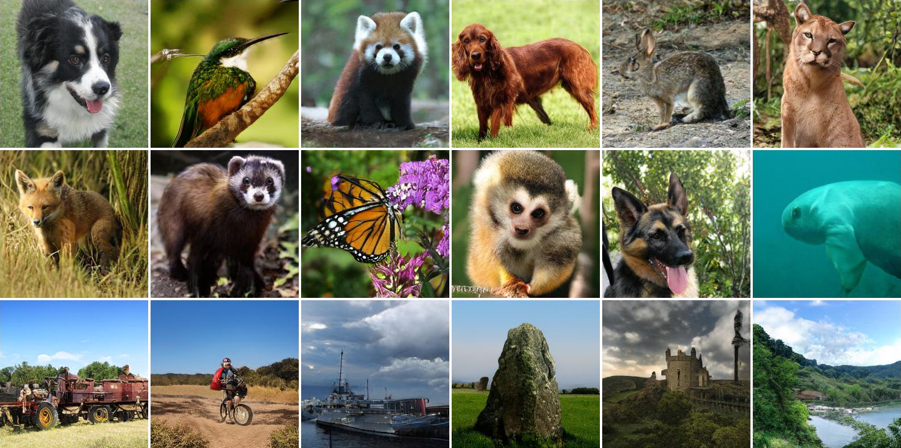

# Instance Selection for GANs

This repo contains code for the NeurIPS 2020 paper [Instance Selection for GANs](https://arxiv.org/abs/2007.15255) by Terrance DeVries, Michal Drozdzal, and Graham W. Taylor. 

<p align="center">
  
  Samples from a BigGAN trained with instance selection on 256x256 ImageNet. Training took 11 days on 4 V100 GPUs.
</p>

## About Instance Selection
Instance selection is a preprocessing technique that is commonly applied in the setting of classification to reduce the size of a dataset. In the setting of GAN training it can be applied to **trade diversity for visual fidelity**. Instance selection for GANs can be performed by removing data points from the training set that lie in low density regions of the data manifold. This method can be seen as similar to the [truncation trick](https://arxiv.org/abs/1809.11096), as they both ignore examples that lie on the fringes of the data manifold to improve sample quality. However, instance selection has the added benefit of **significantly reducing training time and model capacity requirements**, since removing data points *before* training prevents the model from wasting time and capacity trying to model examples that will ultimately be discarded.

## Results

Training models with instance selection results in improvements to image quality, as well as significant reduction in training time and model capacity requirements. On 128x128 ImageNet, instance selection reduces training time by 4x compared to the baseline, and achieves better image quality than a model trained with twice the model capacity. On 256x256 ImageNet, a model trained with instance selection produces higher fidelity images than a model with twice the capacity, while also using approximately one order of magnitude less multiply-accumulate operations (MACS) throughout the duration of training.

#### 128x128 ImageNet

| Model                                                     | Ch | Batch Size | D steps | FID↓      | Precision↑ | Recall↑ | Training Time↓ | Hardware↓ |
|-----------------------------------------------------------|----|------------|---------|-----------|------------|---------|---------------|----------|
| BigGAN                                                    | 64 | 2048       | 1       | 11.5      | 0.76       | **0.66**| 14.7 days     | 8 V100  |
| BigGAN [[1]](https://github.com/ajbrock/BigGAN-PyTorch)   | 96 | 2048       | 1       | 9.8       | -          | -       | 13.4 days     | 8 V100  |
| BigGAN + 50% instance selection                           | 64 | 256        | 1       | **9.6**   | **0.88**   | 0.50    | **3.7 days**  | 8 V100  |

#### 256x256 ImageNet

| Model                                           | Ch | Batch Size | D steps | FID↓            | Precision↑ | Recall↑ | Training Time↓ | Hardware↓ |
|-------------------------------------------------|----|------------|---------|-----------------|------------|---------|----------------|-----------|
| BigGAN [[2]](https://arxiv.org/abs/1809.11096)  | 96 | 2048       | 2       | **9.8**         | 0.86       |**0.70** | **1-2 days**   | 256 TPUv3 |
| BigGAN + 50% instance selection                 | 64 | 256        | 2       | 10.6            | **0.91**   | 0.52    | 10.7 days      | **4 V100** |


#### A Note About Metrics

All metrics are computed using the PyTorch pretrained Inceptionv3 weights. The PyTorch and TensorFlow Inceptionv3 weights give slightly different results, and as such may not be directly comparable.

## Training BigGAN on ImageNet with Instance Selection

To train BigGAN models we use the [BigGAN-PyTorch](https://github.com/ajbrock/BigGAN-PyTorch) repo. We perform minimal changes to the code, consisting only of adding options for instance selection and additional metric logging. A list of changes made to the original repo can be found in the change log at [BigGAN-PyTorch/change_log.md](https://github.com/uoguelph-mlrg/instance_selection_for_gans/blob/master/BigGAN-PyTorch/change_log.md). 

#### Preparing Data
To train a BigGAN on ImageNet you will first need to construct an HDF5 dataset file for ImageNet (optional), compute Inception moments for calculating FID, and construct the image manifold for calculating Precision, Recall, Density, and Coverage. All can by done by modifying and running 
```
bash scripts/utils/prepare_data_imagenet_[res].sh
```
where [res] is substituted with the desired resolution (options are 64, 128, or 256). These scripts will assume that ImageNet is in a folder called `data` in the instance_selection_for_gans directory. Replace this with the filepath to your copy of ImageNet. 

#### 64x64 ImageNet
To replicate our best 64x64 model run `bash scripts/launch_SAGAN_res64_ch32_bs128_dstep_1_rr40.sh`. A single GPU with at least 12GB of memory should be sufficient to train this model. Training is expected to take about 2-3 days on a high-end GPU.

#### 128x128 ImageNet
To replicate 128x128 ImageNet results run `bash scripts/launch_BigGAN_res128_ch64_bs256_dstep_1_rr50.sh`. This script assumes that training will be done on 8 GPUs with 16GB of memory each. To train with less GPUs, or if you encounter out-of-memory errors, you can try reducing `batch_size` and increasing `num_G_accumulations` and `num_D_accumulations` to achieve the desired effective batch size (effective batch size = batch_size x num_accumulations).

#### 256x256 ImageNet
To replicate 256x256 ImageNet results run `bash scripts/launch_BigGAN_res256_ch64_bs256_dstep_2_rr50.sh`. This script assumes that training will be done on 4 GPUs with 32GB of memory each. Batch size and num_accumulations can be adjusted to accomodate more or less GPUs, but please note that the batch size per GPU should not fall below 32, otherwise performance may be degraded.

## Applying Instance Selection to Your Own Dataset

Instance selection can be applied to any unlabelled or class labelled PyTorch dataset using the `select_instances` function. When classes are provided, instance selection will be applied separately for each class.  

The main hyperparameter for instance selection is the `retention_ratio`, a value from 0 to 100 which indicates the percentage of datapoints that should be selected from the original dataset. The retention ratio controls the trade-off between diversity and fidelity. As the retention ratio is reduced, image fidelity should increase, and model capacity requirements and training time should decrease proportional to the amount of data removed. Similarly, the diversity of samples produced by the GAN is expected to reduce as the retention ratio is lowered. 

```python
import torchvision
import torchvision.transforms as transforms
from instance_selection import select_instances

# images are expected to be in range [-1, 1]
transform = transforms.Compose([transforms.ToTensor(),
                                transforms.Normalize(mean=[0.5, 0.5, 0.5],
                                                     std=[0.5, 0.5, 0.5])])

# replace CIFAR10 with your own dataset 
dataset = torchvision.datasets.CIFAR10(root='.', transform=transform, download=True)
instance_selected_dataset = select_instances(dataset, retention_ratio=50)
```

## Citations
If you use this code, please cite
```
@article{devries2020instance,
  title={Instance Selection for GANs},
  author={DeVries, Terrance and Drozdzal, Michal and Taylor, Graham W},
  journal={Advances in Neural Information Processing Systems},
  year={2020}
}
```

## References
[1] Brock, Andrew, and Alex Andonian. "BigGAN-PyTorch". https://github.com/ajbrock/BigGAN-PyTorch  
[2] Brock, Andrew, Jeff Donahue, and Karen Simonyan. "Large scale gan training for high fidelity natural image synthesis." arXiv preprint arXiv:1809.11096 (2018).
